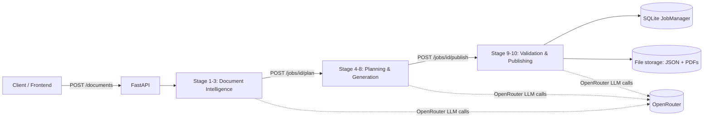

# Teacher AI Platform

Parses an uploaded document (PDF/DOCX/PPTX/TXT), classifies it educationally, and
extracts a structured knowledge representation, exposed via a job-based upload API
with progress streaming.

## Setup

1. Install [uv](https://docs.astral.sh/uv/).
2. Install the system OCR dependency (only needed for scanned PDFs):
   `sudo apt-get install tesseract-ocr` (Debian/Ubuntu) or equivalent for your OS.
3. `uv sync`
4. Copy `.env.example` to `.env` and set `OPENROUTER_API_KEY`.
5. Run the API: `uv run uvicorn app.main:app --reload`

## Usage

- `POST /documents` — multipart form with `file` (PDF/DOCX/PPTX/TXT) and optional
  `doc_nature_hint` (`Mostly Text` / `Text with Tables` / `Text with Diagrams/Figures` /
  `Text with Equations` / `Scanned PDF` / `Not Sure`). Returns `{"job_id": "..."}`.
- `GET /jobs/{job_id}` — current status, stage, progress (0-100), and `result_path`
  once `status` is `completed`.
- `GET /jobs/{job_id}/stream` — Server-Sent Events stream of `{"stage", "progress",
  "status"}` until the job reaches `completed` or `failed`.

## Phase 2: Pedagogical Planning & Generation

- `POST /jobs/{id}/plan` — `id` is a completed Phase 1 document job. Starts the
  Stage 4-8 pipeline (period planning, content, activities, assessment, gap
  analysis) as a new background job and returns that new plan job's status
  (`{"id", "status", "stage", "progress", "error", "result_path"}`).
- `GET /jobs/{id}/plan` — `id` is a plan job. Returns the `TeachingPlan.json`
  body once the plan job's `status` is `completed`; `400` if `id` is not a plan
  job or isn't completed yet.
- `GET /jobs/{id}/result` — generic result fetch that works for both document
  jobs (`DocumentKnowledgeExtract.json`) and plan jobs (`TeachingPlan.json`);
  returns whatever JSON is at the job's `result_path` once `status` is
  `completed`.

Stage 4 (period planning) decides the number and duration of periods
dynamically from the source material rather than assuming a fixed count (FAQ
#3), and every downstream stage — content, activities, assessment, and gap
analysis — grounds its prompts in the Phase 1 `KnowledgeExtract` rather than
re-deriving facts from the raw document (FAQ #4).

## Testing

`uv run pytest -v` — no live LLM calls; classification/extraction are tested against
fake clients. `pytest -m live` markers are not yet defined in Phase 1 (all tests are
offline).

## Phase 3: Validation & TKP Publishing

- `POST /jobs/{plan_job_id}/publish` — `plan_job_id` is a completed Phase 2 plan
  job. Starts the Stage 9-10 pipeline (rule-based + LLM-judge validation,
  Teacher Knowledge Package assembly, PDF rendering) as a new background job
  and returns that new publish job's status
  (`{"id", "status", "stage", "progress", "error", "result_path"}`).
- `GET /jobs/{id}/publish` — `id` is a publish job. Returns the
  `TeacherKnowledgePackage.json` body once the publish job's `status` is
  `completed`; `400` if `id` is not a publish job, isn't completed, or the
  result is unreadable.
- `GET /jobs/{id}/publish/pdf/{kind}` — `id` is a completed publish job,
  `kind` is one of `lesson-plan`, `teacher-guide`, `assessment-book`. Streams
  the corresponding rendered PDF; `400` for an unknown `kind`, `404` if the
  job or PDF file isn't found.

Validation failures (rule-based or LLM-judge issues, including `critical`
severity) are recorded in the package's `validation_report` but never fail
the publish job itself — the job still completes with a full
`TeacherKnowledgePackage.json` and all three PDFs, with `passed=False`
surfaced for the caller to act on.

## Known limitations

- Document text sent to the classification and extraction LLM calls is truncated to
  `MAX_DOCUMENT_CHARS` (8000 characters, see `app/classification/prompts.py` and
  `app/extraction/prompts.py`) per call. Very long chapters may have content beyond
  this limit excluded from the generated knowledge extract.
- The same 8000-character truncation (`MAX_CONTEXT_CHARS`) applies to the five Phase 2
  prompt builders (`app/planning/prompts.py`, `app/content/prompts.py`,
  `app/activities/prompts.py`, `app/assessment/prompts.py`, `app/gaps/prompts.py`), so
  very long knowledge extracts or period content may be truncated before reaching the LLM.

## Architecture



Each stage is a Python package (`app/classification/`, `app/extraction/`,
`app/planning/`, `app/content/`, `app/activities/`, `app/assessment/`,
`app/gaps/`, `app/validation/`, `app/publishing/`) sharing one pattern:
an LLM call with `MAX_RETRIES=2` and a schema-repair follow-up prompt on
invalid JSON. Jobs are chained via `job_type`/`parent_job_id` in
`app/jobs/manager.py` (`document` → `plan` → `publish`); each stage
reports progress into SQLite, streamed to the client over
`GET /jobs/{id}/stream` (SSE).

Orchestration pattern: custom sequential pipeline functions
(`app/jobs/pipeline*.py`), not a third-party agent framework — chosen for
transparency and testability (every stage is independently mockable in
`tests/`).

## Local setup

```bash
uv sync
cp .env.example .env  # set OPENROUTER_API_KEY
uv run uvicorn app.main:app --reload

cd frontend
npm install
cp .env.example .env
npm run dev
```

## Deployment (Hugging Face Spaces)

1. Create a new Space, SDK = **Docker**.
2. Push this repo to the Space's git remote (`git push hf main`).
3. Set `OPENROUTER_API_KEY` as a Space secret (Settings → Repository secrets).
4. The Space builds `Dockerfile` and serves on port 7860 automatically.

The `Dockerfile` multi-stage builds the frontend (`npm ci && npm run build`
in a `node:20-alpine` stage) and copies the resulting `frontend/dist/` into
the `python:3.11-slim` runtime image alongside the backend, so a single
container serves the wizard UI at `/` and the API at its existing paths on
port 7860.
